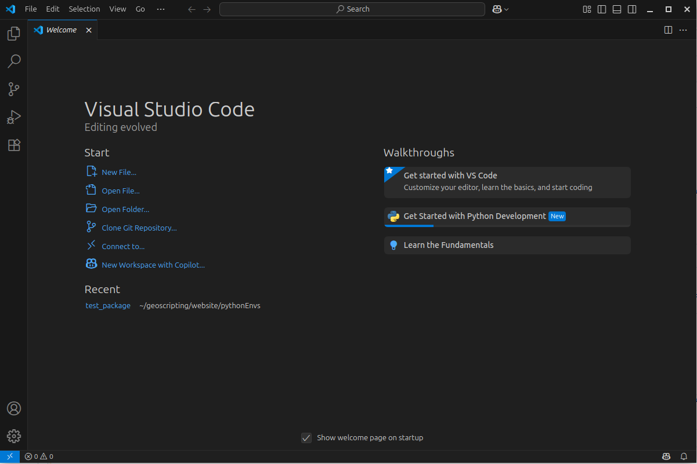
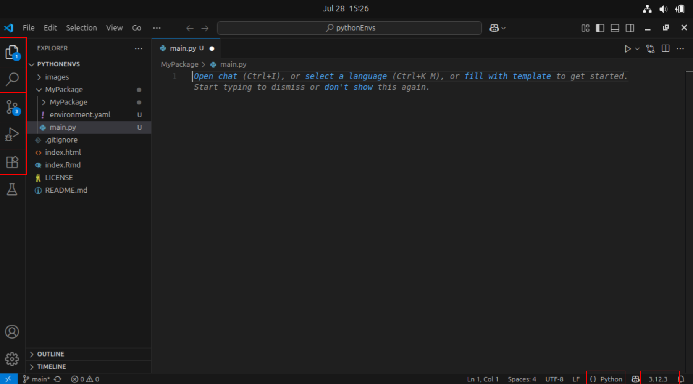
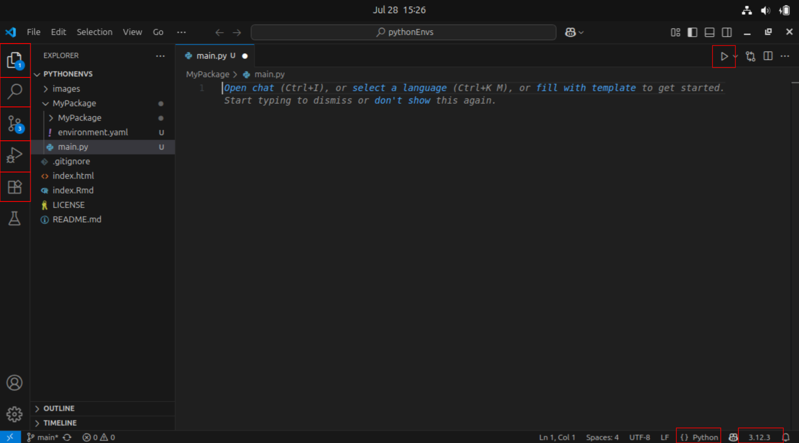

```{css, echo=FALSE}
@import url("https://netdna.bootstrapcdn.com/bootswatch/3.0.0/simplex/bootstrap.min.css");
.main-container {max-width: none;}
pre {color: inherit; background-color: inherit;}
code[class^="sourceCode"]::before {
  content: attr(class);
  display: block;
  text-align: right;
  font-size: 70%;
}
code[class^="sourceCode r"]::before { content: "R Source";}
code[class^="sourceCode python"]::before { content: "Python Source"; }
code[class^="sourceCode bash"]::before { content: "Bash Source"; }
```

<font size="6">[WUR Geoscripting](https://geoscripting-wur.github.io/)</font> 

# Tutorial 8: Python Environments

## Introduction

Good afternoon and welcome to the python part of this course! Today we will introduce how we will work with Python during this course and show some alternative methods. If you are unfamiliar with Python and/or feel that you need more training, follow one of the Datacamp courses as introduction into Python *before today*:

* [Introduction to Python](https://www.datacamp.com/courses/intro-to-python-for-data-science) | recommended to follow if you haven't any scripting experience so far
* [Python for R users](https://www.datacamp.com/courses/python-for-r-users) | recommended if you have experience already in R

## Today’s Learning objectives

- Know how to work with virtual environments: *Conda* + *Mamba*
- Know how to run a Python script from the terminal
- Get introduced to Python editors and IDEs
- Refresh Python programming knowledge
- Familiarize yourself with some visualization techniques

# Introduction to Python & Environments

Python is a jack-of-all-trades programming language that is free, flexible, open-source, cross-platform and has a very large community behind it, according to many rankings it's the most popular programming language. If you ask Python programmers what they like most about Python, they will often cite its high readability and high availability of good packages. Python was developed by Guido van Rossum, a Dutch computer scientist. Python was designed to be an everyday programming language, easier to use than for example C++ or Java while still being able to do do almost everything. The thought has always been that the time of the programmer is more important than the time of the computer, therefor reading and writing Python code is relatively easy compared to compiled languages, but these compiled languages are sometimes quicker. Luckily there are lots of very quick functions available in Python that might be programmed in different languages.

Because of the popularity, and therefor the large community, behind Python, there are many packages available for geoscripting, data wrangling, visualization, machine learning and for almost everything else. Additionally, there is a giant community present at for example [stackoverflow](https://stackoverflow.com/questions/tagged/python) where you can find help if you are stuck. Also, since there is so many python code online, generative AI is relatively good at writing Python. Be careful though, a lot of the code is not written for spatial data analysis, so large language models might behave strangely. 

Relevant packages for this course are for example:

* Geoscripting
    * GeoPandas (Vector Processing)
    * Rasterio (Raster Processing)
    * GDAL/OGR (Vector and Raster Processing)
    * QGIS plugins (Open Source GIS)
    * ArcPy (Propietary GIS)
* Data Handling
    * Pandas (Dataframes and Data Analysis)
    * NumPy (Scientific Computing)
* Visualization
    * Matplotlib (General Graphics)
    * Seaborn (Statistical Graphics)
    * Folium (Interactive Maps)
* Machine Learning
    * scikit-learn (Machine Learning)
    * Keras + TensorFlow (Deep Learning)
    * PyTorch (Deep Learning)

## Python package management with Conda
The high availability of packages is also a threat sometimes. Packages also make use of code and functionality from other packages. We call this dependancy. If a piece of software is developed depending on a package, but this packages changes later on, the initial piece of software not work anymore. Different packages require different dependencies that they are built upon. It is important to make sure all these dependencies are working together and that the right versions of the dependencies are used. Luckily, a set of tools exist for installing and managing Python packages. It is possible to install packages on your main Python installation (This main python is called the **base** python interpreter), but sooner or later you will get conflicting Python packages since packages have varying dependencies and you might have installed several versions of the same package. It can even [break your system Python interpreter](https://askubuntu.com/questions/95037/what-is-the-best-way-to-install-python-packages). 

Therefor, we strongly recommend to use a Python package manager that uses of virtual environments. This way, you can create a separate environment on your machine for each project. In these environments, any dependency of the project, such as python packages, other software or C libraries can be installed. We will use them here for installing Python packages. Packages installed in one environment do not interfere with your base Python or with other environments. Additionally, it is possible to export and share  a complete list of the requirements for your (open source) project with collaborators or users of your code. In this way, collaborators can install the dependencies and start working with your code right away, instead of struggling with dependecies first (this is called [Dependency Hell](https://en.wikipedia.org/wiki/Dependency_hell). 

## Mamba installation
For this course, we will make use of *Mamba*, a fast drop-in reimplementation of the *Conda* package manager. It has its core parts implemented in C++ for maximum efficiency, makes use of parallel downloading of repository data and package files using multi-threading, and uses `libsolv` for (much) faster dependency solving. To install *Mamba* in your Linux environment, we have prepared a short *Bash* script for you. Just run the following lines of code, line by line, in a new terminal window.

```{bash, eval=FALSE}
git clone https://github.com/GeoScripting-WUR/InstallLinuxScript.git
cd InstallLinuxScript/user
chmod u+x ./install.sh
./install.sh
```

This will install *Mamba* into `~/mamba`. Finally, restart your terminal to be able to use *Mamba* and *Conda* in the terminal. Next, let's see how to use *Mamba* in case you want make new virtual environments by yourself, or install packages after creating the environment.

## Mamba usage
*Mamba* creates isolated conda environments with sets of packages, that do not interfere with your base Python or with other conda environments. To create an environment:

```{Python, engine.path='/usr/bin/python3', eval=TRUE}
mamba create --name geotest python numpy
```

This creates a new environment called *geotest* with *Python* and *NumPy* installed into the conda environment. Another option is to create an environment from a file. The advantage of using a file is that the file, with the dependencies can be shared within a project. For this applciation a [YAML](https://yaml.org/) file is used. In this file all required packages are listed and if required which version should be used. An example of a YAML file is the following: 

```
name: geotest
dependencies:
  - python
  - numpy
```

The first line defines what the evnironment will be called (`geotest` in this example) and what packages should be installed (python and numpy). As you can see, this definition of the `geotest` environment is the exact same as the geotest environment as defined before. To create the geotest environment from such a file, save this yaml to a new file named `env.yaml`, or however you want to call it and use the argument `--file` (or `--f` in short):

```{Python, engine.path='/usr/bin/python3', eval=TRUE}
mamba env create -f env.yaml
```

Let's list the currently available environments:

```{Python, engine.path='/usr/bin/python3', eval=TRUE}
mamba info --envs
```

*Mamba* puts an asterisk (\*) in front of the active environment. Now we activate the environment. While *Mamba* replaces *Conda* for most commands, this is not the case for (de)activating environments:


```{Python, engine.path='/usr/bin/python3', eval=TRUE}
source activate geotest
```

After this, the current environment is shown in parentheses in front of your prompt (`(geotest)$`). Note that the activated environment is only valid for the shell in which you activated it. For instance, if you close the shell window and open a new one you will have to activate it again.

After creating a conda environment, (additional) Python packages can be installed. There are three possible ways to install packages, which we list below.

* Using *Mamba* to install and manage conda packages. This downloads conda packages using conda channels, which are URLs to directories containing the conda packages. **Generally, installing conda packages using *Mamba* is the preferred method.**
* Using *pip* to install packages and *Mamba* to manage these packages. *pip* is available for Windows, macOS and Linux. *pip* can also install [binary wheels on Windows](https://www.lfd.uci.edu/~gohlke/Pythonlibs). You should generally not install packages from *pip* in a conda environment unless it's the last resort. This is because after you use *pip* to modify an environment, you can no longer use `conda`/`mamba` to do so (trying that will break your environment, because *pip* does not communicate its changes to *Conda*). Hence install packages with `mamba` that you can first, and only then use `pip`, and then never touch the environment with `mamba` again (delete and start fresh if you need to).
* Using the distribution's package manager (only on Ubuntu, that is `sudo apt-get install python-*`).

The `mamba search` command searches a set of channels. By default, packages are automatically downloaded and updated from the default channel. To search for a package, type:

```{Python, engine.path='/usr/bin/python3', eval=TRUE}
mamba search pandas
```

This gives a list of all packages that have "pandas" in the name and lists all available versions. To install:

```{Python, engine.path='/usr/bin/python3', eval=TRUE}
mamba install pandas
```

This installs the latest compatible version of _Pandas_. Note that this would install it into your currently activated environment.

Note that you can also install multiple packages at the same time: 

```{Python, engine.path='/usr/bin/python3', eval=TRUE}
mamba install geopandas matplotlib
```

*Mamba* is also able to install some non-Python packages that have Python bindings. For example with mamba we can install *jupyter*, a web based editor for writing and evaluating code per cell (more on jupyter later). This is useful for making sure your Python and binary versions match and do not interfere with the system-wide ones.

Some additional helpful utilities for package management in this context are:

* `mamba list` to check which packages are installed in `root` or in the active environment;
* `python --version` or `gdal-config --version` to check which Python or GDAL version is used in the environment;

Removing packages is just as simple:

```{Python, engine.path='/usr/bin/python3', eval=TRUE}
mamba remove geopandas pandas folium
```

Now, we deactivate the environment and return to base environment.

```{Python, engine.path='/usr/bin/python3', eval=TRUE}
source deactivate
```


## Running a Python script in the terminal

Within a conda environment, Python can be started directly, or can be called to run a script file. To start Python directly:

```{Python, engine.path='/usr/bin/python3', eval=TRUE}
python
```

Now, you can type Python expressions that will be executed one by one:

```{Python, engine.path='/usr/bin/python3', eval=TRUE}
import sys
print(f'Good morning, you are running Python version: {sys.version}')
```

To go back, type:
```{Python, engine.path='/usr/bin/python3', eval=TRUE}
exit()
# or 
quit()
```

Usually, we do not want to run expressions one by one, but build scripts instead, to ensure transferability and reproducibilty. Create a new text file and (re)name it (to) `test.py`. Open it, for example with a text editor, paste in the code you used above (`import sys` etc.), and save the script. Navigate in the terminal to the location where this script is stored, using `cd`. Finally, run the script with:

```{Python, engine.path='/usr/bin/python3', eval=TRUE}
python test.py
```

The output is printed to the terminal. Running a script from the terminal is less error-prone than running it from an IDE (see the next section), such as Spyder or Visual Studio Code, as IDEs often keep variables in memory after the script has finished running. Therefore, running a script from the terminal is a good final test before submitting an exercise or assignment. 

# Python editors and IDEs
There are many Integrated Development Environments (IDEs) for Python, and every programmer has their own preference. An IDE is a software application that provides facilities for software development. There are roughly two ways in which python developers are working with python.

1. Writing scripts and mainly working with out of the box functionality from packages in notebooks. In this way you might explore some data or do remote analysis that requires a lot of computing resources. Jupyter Notebooks and Jupyter Labs is developed for this purpose. 
    * [Jupyter notebook](http://jupyter.org/) integrates visualization with code and is suitable for making tutorials, dashboards, data exploration, do prototype  testing or run largely predefined functionality. It is not suited to do develop large projects in. Jupyter Notebook runs in a browser on a localhost server or on a web server, for example remotely on a cluster or on [Google cloud](https://colab.research.google.com/). In Jupyter you mix text (documentation or explanation) with code and images (plots for example). Jupyter is cell-based, meaning that code is run per cell. The variables and objects are stored in memory across cells. Since Jupyter saves the state, including the output of a cell, it does not work very well with git. Additional tools are needed for colaborating and making sure that the output from one used does not interfere with another user's output, even if it is the same output. 
  
2. Writing python code for larger projects, requiring functions, multiple modules and multiple files. For larger projects, some additional tooling is very helpful. IDE's come with tooling to support git, debugging, autocompletion and GenAI. In these IDE's, in contrast to Rstudio, code is run per file instead of line by line or cell by cell as in notebooks. A file might import other files and so on. This might need some getting used to but the debugger is there to help ou and inspect how the interpreter is reading your code. Two IDE's that are good to know: 
    * [Visual Studio Code](https://code.visualstudio.com/): Visual Studio Code (VScode) is a very complete IDE. It can be used to develop software in almost all languages and it has a lost of advanced functionality. VScode is developed by Microsoft, but it is built upon an open source distribution and numerous packages exist that are open source, for example Python functionality. *In this course, VSCode is the recommended Python IDE, it is pre-installed. in the Linux VM.*
    * [PyCharm Community Edition](https://www.jetbrains.com/help/pycharm/install-and-set-up-pycharm.html) is a free professional Python IDE with a lot of advanced functionality, such as integrated GIT version control, code completion, code checking, debugging and navigation. This IDE can optionally be used as an alternative to VSCode. If you have experience, you can use Pycharm instead of VScode, but do know that you will not be assisted for solving IDE-related issues.


Lastly, an IDE that is good to mention is [Spyder](https://www.spyder-ide.org/). Spyder is a lightweight IDE, it is similar to Rstudio. 


## Visual Studio Code

Visual studio code is a complete IDE that is used by many developers, Python developers but also developers for other languages. To get started in VSCode we will set up a basic project structure and run some very basic code. Create the following files: 

```
  MyPackage/
  ├── environment.yaml
  ├── main.py
  └── MyPackage
      └── __init__.py
```

</img>


Create an empty directory `MyPackage` and open it using the button that shows in the main screen when you open VSCode. Create the files as the file tree shows above. Open `main.py`, and write the following code:
```{Python, engine.path='/usr/bin/python3', eval=TRUE}
print('hello world')
```


VSCode directly recognizes the python file extention (.py) and does some suggestions. In the bottom right you can what type of file VSCode thinks you are working in, it also shows a number, most likely 3.12.3 if you are following this course in 2025. This number is the python version of the interpreter that is now running, more on this later. In the right there is a column with some buttons. These buttons are, from top to bottom, for:
* Files, showing the project files. Clicking on a file opens it.
* Search, giving the option to searching and replacing text throughout the project
* version control, showing the git status of the project. 
* Run and debug, showing results and the state during debugging
* Extentions, for insatlling and maintaining extentions. 
* Testing, for testing code (we will not use this throughout the course)

Open the `environment.yaml` and paste the following in there:
```
name: geotest
dependencies:
  - python
  - numpy
```

</img>

### Extentions 

You can run the code by pressing the play bottom in the top right. When you do this, a terminal pops up, showing the output of the file. As explained before, in vscode we run code per file instead of per line as we are used to in R. As you can see, already out of the box there is some python functionality that is built into VScode, but there is more. Open the extentions pane, type python and install the extentions Python and Python Debugger. These are the extentions that we will use throughout the course, more is not necessary for now, but there is a whole world out there. 

</img>

To show you some of this functionality, write the following code in the `MyPackage.__init__.py`: 

```{Python, engine.path='/usr/bin/python3', eval=TRUE}
def some_function(a_number):
    print(f'I am printing the number {a_number}') # This is is a formatted string
```

Now, in the `main.py` file, run the function.:
```{Python, engine.path='/usr/bin/python3', eval=TRUE}
some_function(5)
```

A yellow squiggly line showed up. This means something is wrong with the code. And this is right, if we would run the code python would complain that the function is not known. We forgot to import it, we defined it but did not import it yet. If you stand with your cursor in the function call, and pres `ctrl` + `.`, visual code will try to figure out how to solve the issue. In this case it proposes to import it from `MyPackage.MyPackage`. If you press enter it imports the function. You can now run the function. 

If you press `ctrl` and click on the function in `main.py` you will open the function definition. This is very useful when navigating through a large project.

### Environments in VSCode

As we mentioned before the numbers in the bottom right show the version of the python interpreter associated with the project. We learned about environments before, so let's create an environment. VSCode comes with a bash terminal. If you ran some code before this might be open, otherwise click terminal in the top menu (in the same sectiona as `File` and `Edit`) or press `ctrl`+`shift`+\` (use the backtick, most likely on the top left of your keyboard.) 

First we need to set up our environment. Activate the geotest environment if you created it before or create it using the yaml. 

```{Python, engine.path='/usr/bin/python3', eval=TRUE}
# One of the following
mamba env create -f environment.yaml

# or 

source activate geotest 
```

If `(geotest)` is visible before the active line in the terminal the environment is succesfully activated. However, this is something different than associating it to the project, if you run a file this interpreter will still not be used. To do this we are going to use the Command Palette. Click the bar in the  top center or press `Ctrl` + `Shift` + `p` to open it. Type `>Python: select interpreter`. The `>` sign tells VScode your are looking for commands. Without you can search files in the project. It autocompletes, so `python` is enough. Select it. It should already show up. It also gives the option to create a new environment, more on that later. 

In the `main.py` type: `import numpy as np`. You can see it tries to autocomplete, and if you now type `np.a` VSCode will find all functionality in numpy starting with an a. When you try to import something that does not exist, you can again see this because of the green squiggly line. You can install packages in the environment using the integrated terminal. Check if the terminal has the environment name in brackets in front of the active line, if not close the terminal and open it again.

#: elaborate? 


### Debugger & REPL

### Git


#:TODO debugger
#:TODO git
#:TODO 

## Jupyter Notebook

Jupyter Notebook is actually not a IDE but it is very useful for writing code. Jupyter stands for the languages that once can use (*JU*lia, *PY*thon and *R*) and notebooks means that they are actually files instead of an IDE (such as Rstudio or Spyder). The notebooks can be interpreted and run by varying interpreters of which we will cover two later on. Jupyter Notebook integrates code and visualization, and are therefore very helpful for demonstration purposes and to be run by online interpreters (such as Google Colab). First we will show how to run Jupyter Notebook locally. To do this install `jupyter` and the module `folium` in an existing or new environment that includes Python. To start Jupyter type:

```{Python, engine.path='/usr/bin/python3', eval=TRUE}
jupyter notebook
```

Jupyter should pop up in your browser. Note that although jupyter is opened in your browser, internet is not used, the code is interpreted and run locally. You will see a menu with all files in your working directory. The Jupyter Notebook will only see files that are accessible from the working directory in which you launched the notebook!

Make a new folder: *New* → *Folder*, rename the folder (check the box next to the new 'Untitled Folder' and click **'Rename'** in the top) and, in this folder, create a new Python3 Jupyter Notebook *New* → *Python 3*. Give your notebook a name by clicking on *untitled*. Note that this creates a file with the extension *.ipynb*, short for 'Interactive Python Notebook', which is the file format of Jupyter Notebook. 

Feel free to have a go at the user interface tour (*Help* → *User Interface Tour*), or hover over the toolbar to check out the tools. The main tools are:

- _Save and checkpoint_
- _Insert cell below_
- _Run_
- _Code/Markdown/Heading_ (List box)

Similar to RMarkdown, Jupyter Notebooks have code cells (*Code*) and text cells (*Markdown*). Insert two extra cells by clicking the + button and change the first cell from code to markdown. Enter some documentation for your code (e.g. your team name, exercise and date). Leave the other cell on code. 

Type the following Python code in the code cell:

```{Python,engine.path='/usr/bin/python3', eval=FALSE}
import folium

m = folium.Map(location=[51.9700000, 5.6666700], zoom_start=13)
m
```

Run the code cell by selecting it and pressing the *Run* button, or press *CTRL + Enter* or *Shift + Enter*. You'll see a map visualized below your code, similar to the one below. Try to drag the map to play around with it. 

</img>

Your Jupyter Notebook is automatically saved as an `.ipynb` file on your computer. The notebook can be downloaded as a Python script, pdf or html. You can also save it manually. 

To exit a notebook properly, use *File* → *Close and Halt*. After that, by pressing Ctrl + c in the terminal where Jupyter Notebook server is running, you cancel the running process. The terminal goes back to command line and you can exit the virtual environment by typing `conda deactivate`.

```{r, engine='bash', eval=FALSE}
conda deactivate
```

### Google Colab
As said before, Jupyter is locally opened in your browser. It does not connect to the internet, but it does show the possibilities, one could create something online that can run your notebooks for you on the cloud. This is exactly what Google does with Google Colab. Google Colab is a cloud service that allows you to run your Jupyter notebooks on the Google cloud for free. Let's see what this looks like: 

* Go to https://colab.research.google.com/notebooks/empty.ipynb (note the similaritie and differences between Jupyter locally and on Google Colab);
* Type `!pip install folium` and press ctrl+enter to run and  install folium;
* In a new cell run the same python code as locally to create and show a new folium map.

For this course we will rarely use Jupyter Notebook and or Google Colab, but it is good to know they exist. Especially Google Colab is being used more and more in the scientific community and you are likely to come across these during other courses. 

# Spyder

Spyder is a IDE for developing python mainly for scientific purposes. Fun fact, it is [completely written in python](https://github.com/spyder-ide/spyder)! Spyder is a very complete IDE that looks a bit like Rstudio. It shows the variables present in the current session, it has a code editor, a console and a figures pane in the main view. 

The [Spyder IDE](https://docs.spyder-ide.org/) can be started in a terminal when the *Spyder* package is installed in the active conda environment. So, using *Mamba*, make an environment and install Spyder to that environment. Activate the environment. Spyder will automatically make use of the Python interpreter of the active conda environment. To start Spyder:

```{r, eval=FALSE,engine='bash'}
spyder
```

In Spyder you should see an editor, a file explorer and a console. Have a look at the toolbar. Some important shortcuts are:

* F5 to run your script
* CTRL + S to save your script
* CTRL + 1 to comment/uncomment your code
* TAB to indent your code
* SHIFT + TAB to unindent your code

Open a new file and save it somewhere as `main.py` (File -- > New File --> Save As). Test writing a few lines of code and running the script.


# Putting it to the test

## Setting up the environment

Now that we know how to set up an environment and run code, lets use this new knowledge and run some Python code. Again, During this course advise you to code in Spyder, as this IDE is the recommended IDE for the Python part of this course. To practice you might also want to try out Jupyter locally and Google Colab to run the same code.

First, make a directory structure for this tutorial:

```{r, eval=FALSE,engine='bash'}
cd ~/Documents/
mkdir PythonRefresher #or give the directory a name to your liking
cd ./PythonRefresher
mkdir output
```

We only make a directory for output, because no input data or separate scripts are created in this tutorial. Next, we will create a conda environment from a file. First create a text file in your preferred text editor, e.g. `gedit`. Then, (re)name it (to) `refresher.yaml`, and copy the following content into the file:

```
name: refresher
dependencies:
  - python
  - numpy
  - matplotlib
  - geopandas
  - spyder
```

Now, create a new conda environment based on this file:

```{Python, engine.path='/usr/bin/python3', eval=TRUE}
mamba env create --file refresher.yaml
```

Once everything is installed, activate the environment and start Spyder:

```{Python, engine.path='/usr/bin/python3', eval=TRUE}
source activate refresher
spyder
```

Create a new Python script and save it. 

Important to note: for compatibility, it is best to install packages from the same channel as much as possible. Given that packages in the file `refresher.yaml` are installed from the `conda-forge` channel, it is wise to use this same channel when you want to install additional packages in your environment. 


## Quick refresher
In the tutorial about R and Python we have gone over the differences and similarities of python and R. This tutorial also contains some basic python syntax, in this tutorial we assume you know this content, but we will go over a few basics here as well. The examples below are mostly meant for reference purposes, we  assume you understand most of this refresher already. 

### Printing and basic data types
In Python we assign variable using the equals sign (`=`):

Printing in Python is done using the `print` function. We can print variables directly: 

```{r, engine = 'Python', eval=FALSE}
# Integer
age = 25

# Float
height = 1.75

# String
name = "John Doe"

# Boolean
is_student = True

# Print a name
print(name)
```

We can use string formatting to use flexible strings, for example for printing. to start a formatted string, we put a `f` before the string. We can use curly brackets `{}` in this formatted string. The text between these curly brackets is executed as regular Python code. 

```{r, engine = 'Python', eval=FALSE}
# String formatting and printing 
print(f'{name} is {age} years old and is {height} meters tall.')
```

### Basic arithmetic operations:
```{r, engine = 'Python', eval=FALSE}
a = 10
b = 5

addition = a + b
subtraction = a - b
multiplication = a * b
division = a / b
modulo = a % b
exponentiation = a ** b

print(addition, subtraction, multiplication, division, modulo, exponentiation)
```


### Conditional statements
```{r, engine = 'Python', eval=FALSE}
x = 15

if x > 10:
    print("x is greater than 10")
elif x == 10:
    print("x is equal to 10")
else:
    print("x is less than 10")
```


### Loops (for and while)
```{r, engine = 'Python', eval=FALSE}
# For loop
for i in range(5):
    print(i)

# While loop
count = 0
while count < 5:
    print(count)
    count += 1
```

### Lists and basic list operations
```{r, engine = 'Python', eval=FALSE}
# Creating a list
fruits = ["apple", "banana", "orange"]

# Accessing elements
print(fruits[0])  # Output: "apple"

# Adding elements
fruits.append("grape")

# Removing elements
fruits.remove("banana")

# Length of the list
print(len(fruits))  # Output: 3
```


### Functions
```{r, engine = 'Python', eval=FALSE}
# Function to add two numbers and return the result
def add_numbers(a, b):
    return a + b

result = add_numbers(5, 3)
print(result)  # Output: 8
```


### Dictionaries
```{r, engine = 'Python', eval=FALSE}
# Creating a dictionary
person = {
    "name": "Alice",
    "age": 30,
    "is_student": False
}

# Accessing values
print(person["name"])  # Output: "Alice"

# Adding a new key-value pair
person["occupation"] = "Engineer"

# Removing a key-value pair
del person["is_student"]
```


### Importing packages
Python is used by a very large community, as is said before. One of the reasons for this is that this entire community builds a lot of (open source) packages. It is therefor very useful to be able to build upon these packages. In R you have worked a with *dataframes* and *spatial dataframes*. In Python these are not standard datatypes, but they are implemented in very well known packages called `Pandas` and its spatial counterpart `GeoPandas.` We will go in much more detail during the Python-Vector tutorial but we will introduce them quickly here. 

In Python we import a package using the `import` statement (instead of th the `library` function in R) . For example importing the pandas package goes as follows:

```{r, engine = 'Python', eval=FALSE}
import pandas as pd
```

As you can see we can import a package *as* something. We use this if we want to point at specific functionality of this package. If we want to point at for example the `read_csv` function from pandas we we call `pd.read_csv`. This function is also implemented in other packages, but now we are sure we use the pandas version of this function. Importing pandas is a convention, used very widely in the python community. 

We can create a `dataframe` as follows: 
```{r, engine = 'Python', eval=FALSE}
data = {
    'Name': ['Alice', 'Bob', 'Charlie'],
    'Age': [25, 30, 22],
    'City': ['New York', 'San Francisco', 'Chicago']
}

df = pd.DataFrame(data)
print(df)
```   

We can access some information from this `dataframe` as follows:

```{r, engine = 'Python', eval=FALSE}
# Display the first few rows of the DataFrame
print(df.head())

# Get statistical information about the DataFrame
print(df.describe())

# Access a specific column
print(df['Age'])
```   

### GeoDataFrame
The spatial counterpart of a `dataframe` is a 'GeoDataFrame', which we normally import *as* `gpd`: 
```{r, engine = 'Python', eval=FALSE}
import geopandas as gpd

# Dummy data for the GeoDataFrame
data = {
    'Name': ['Location A', 'Location B', 'Location C'],
    'Latitude': [40.7128, 34.0522, 41.8781],
    'Longitude': [-74.0060, -118.2437, -87.6298]
}

# Create the GeoDataFrame with a single line of code
gdf = gpd.GeoDataFrame(data, geometry=gpd.points_from_xy(data['Longitude'], data['Latitude']))

# Display the GeoDataFrame
print(gdf)
```


# Python help

There are several ways to find help with programming in Python. Searching the internet typically solves your problem the quickest, because it finds answers on multiple platforms, such as StackOverflow and GitHub. During Geoscripting we have the forum to ask and give help. Asking your friends or colleagues in person is also a great way to learn and fix programming problems. Another good option is get documentation from the package website or inside Python:

```{Python,engine.path='/usr/bin/python3', eval=FALSE}
import sys
help(sys)
```

See how the objects and functions in the `sys` package got listed.

```{block, type="alert alert-success"}
> **Question 4**: What kind of functionality does the `sys` package provide?
```

# More info
- [Official Python tutorial](https://docs.Python.org/3/contents.html)
- [Python Style guide ](https://www.python.org/dev/peps/pep-0008/)
- [Python 3 Cheatsheet](https://ugoproto.github.io/ugo_py_doc/py_cs/)
- [Overview Python package Cheatsheets](https://www.datacamp.com/community/data-science-cheatsheets?tag=python)
